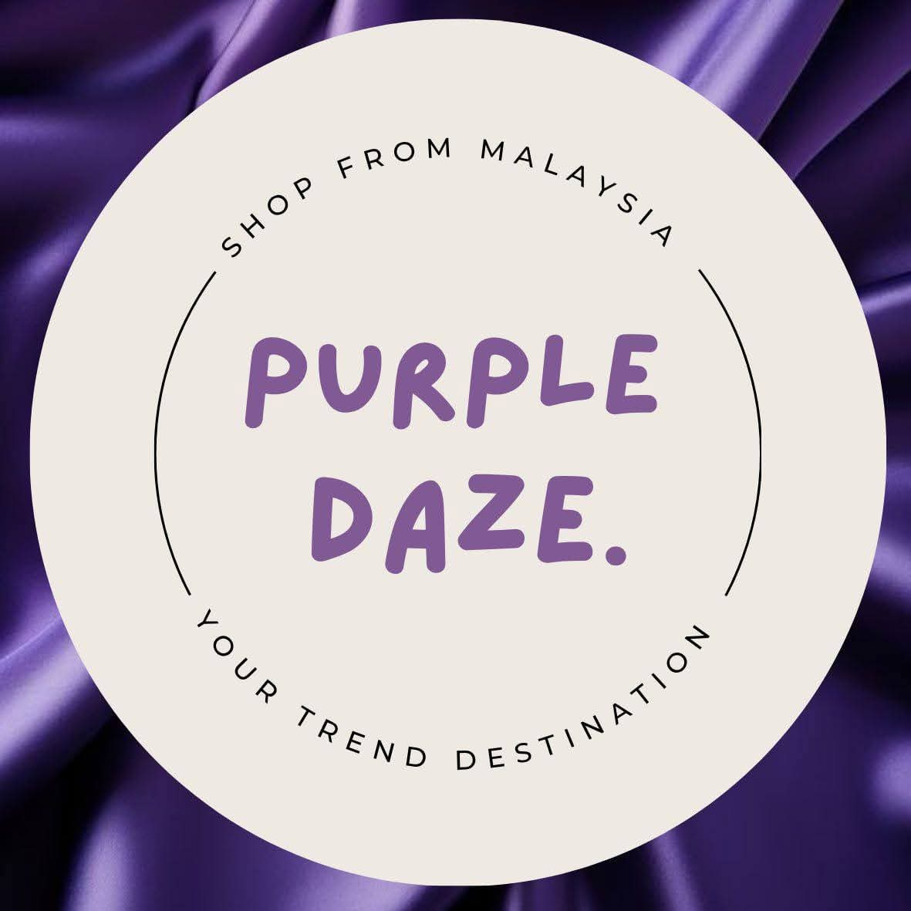
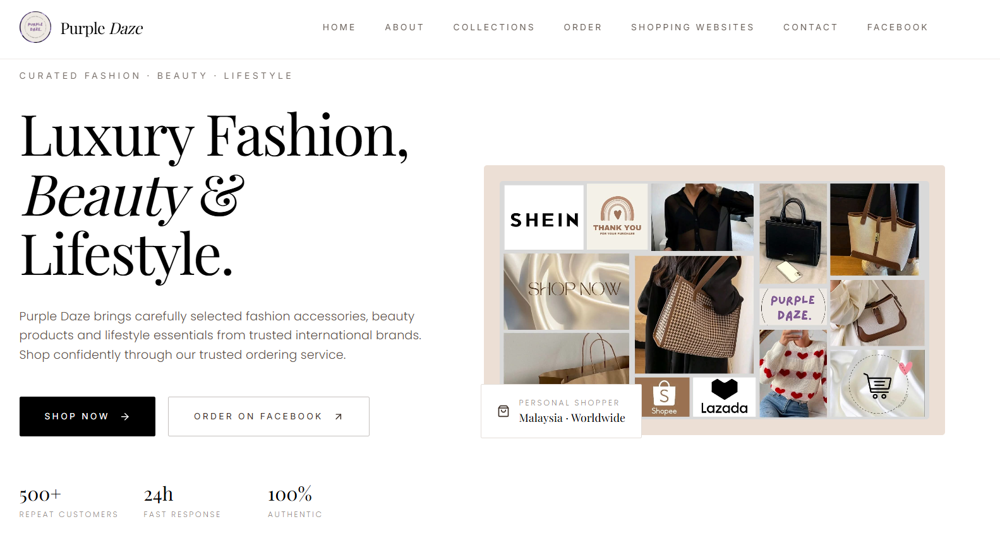

#  Purple Daze

<p align="center">
  
</p>

<h3 align="center">
Luxury Fashion • Beauty • Lifestyle
</h3>

<p align="center">
A modern luxury shopping website for ordering authentic fashion, beauty, lifestyle products and accessories from trusted Malaysian and international brands.
</p>

<p align="center">

[](https://purple-daze.vercel.app/)
[](https://github.com/MahimKatha02/purple-daze)

</p>

---

# 📸 Website Preview

<p align="center">

</p>

---

# ✨ About Purple Daze

Purple Daze is a trusted online shopping platform that helps customers purchase authentic fashion, beauty, lifestyle products and premium accessories from leading Malaysian and international brands.

We simplify international shopping by providing:

- Authentic Products
- Trusted Personal Shopping
- Secure Ordering
- International Brand Access
- Malaysia Shopping Support
- Fast Customer Response

---

# 📊 Business Overview

| Feature | Details |
|----------|----------|
| Business Name | Purple Daze |
| Industry | Fashion & Lifestyle |
| Services | Personal Shopping |
| Product Type | Luxury Fashion, Beauty & Lifestyle |
| Coverage | Malaysia & International |
| Order Method | Facebook Messenger & WhatsApp |
| Response Time | Within 24 Hours |
| Customers | 500+ Repeat Customers |
| Authenticity | 100% Authentic Products |

---

# 🚀 Live Website

### 🌐 Visit Here

https://purple-daze.vercel.app/

---

# 📦 Collections

The website currently offers the following product categories.

| Category | Description |
|-----------|-------------|
|  Luxury Bags | Premium handbags & designer bags |
|  Perfumes | Authentic fragrances |
|  Beauty Products | Skincare & cosmetics |
|  Wallets | Leather accessories |
|  Travel Bags | Premium travel essentials |
|  Fashion Accessories | Everyday luxury accessories |

---

# ⭐ Why Purple Daze?

✔ Authentic Products

✔ Trusted Personal Shopper

✔ Fast Response

✔ Secure Ordering

✔ International Brands

✔ Malaysia Shopping Support

---

# 🛍️ How Ordering Works

| Step | Process |
|-------|----------|
| 01 | Browse your favorite products from our trusted partner stores below. |
| 02 | Send us the product link through Facebook Messenger or WhatsApp. |
| 03 | We verify availability, pricing and delivery details. |
| 04 | Confirm your order by completing the booking payment via **bKash, Nagad or DBBL Fund Transfer**. |
| 05 | Sit back and relax while we deliver your authentic products safely to your doorstep within **4–6 weeks** of order confirmation. |

---

# 🏬 Supported Shopping Websites

Purple Daze currently accepts orders from these trusted stores.

| Brand | Category |
|--------|----------|
| SHEIN | Fashion |
| Shopee | Marketplace |
| Lazada | Marketplace |
| Nike | Sportswear |
| Adidas | Sportswear |
| UNIQLO | Apparel |
| H&M | Fashion |
| IKEA | Home & Lifestyle |
| Sephora | Beauty |
| Watsons | Health & Beauty |
| Guardian | Personal Care |
| Zalora | Fashion |
| Charles & Keith | Bags & Shoes |
| Victoria's Secret | Beauty & Lingerie |
| Bath & Body Works | Fragrance |

---

# 📞 Contact Information

| Type | Details |
|------|---------|
| 👤 Owner | Mahim Chowdhury Katha |
| 👨‍💼 CEO | Akibul Hasan Arman |
| 📧 Email | thepurpledaze@gmail.com |
| 📱 Phone | +8801930647457 |
| 💬 WhatsApp | +8801930647457 |
| 📘 Facebook | https://facebook.com/purpledaze11 |

---

# 🛠️ Built With

| Technology | Purpose |
|------------|---------|
| React | Frontend |
| TypeScript | Programming Language |
| TanStack Router | Routing |
| Tailwind CSS | Styling |
| Motion | Animations |
| Lucide React | Icons |
| Vite | Build Tool |
| Vercel | Deployment |
| Git | Version Control |
| GitHub | Repository Hosting |

---

# 📂 Project Structure

```
purple-daze/
│
├── public/
│   ├── FB_IMG_1783421037036.jpg
│   ├── website-preview.png
│   ├── beauty.jpg
│   ├── perfumes.jpg
│   ├── luxuary-bag.jpg
│   ├── wallets.jpg
│   ├── travel-bag.jpg
│   └── accessories.jpg
│
├── src/
│   ├── assets/
│   ├── routes/
│   ├── components/
│   └── styles/
│
├── package.json
└── README.md
```

---

# 📈 Website Features

- Responsive Design
- Mobile Friendly
- Smooth Scroll Animations
- Luxury Minimal UI
- Interactive Cards
- Animated Hero Section
- Order Timeline
- Shopping Website Directory
- Facebook CTA
- WhatsApp CTA
- Contact Section
- Modern Footer

---


# 💻 Installation

Clone the repository

```bash
git clone https://github.com/MahimKatha02/purple-daze.git
```

Go into the project

```bash
cd purple-daze
```

Install dependencies

```bash
npm install
```

Run development server

```bash
npm run dev
```

Build production

```bash
npm run build
```

Preview production

```bash
npm run preview
```

---

# 🚀 Deployment

This project is deployed using **Vercel**.

Live Website

https://purple-daze.vercel.app/

---

# 📌 Repository

GitHub Repository

https://github.com/MahimKatha02/purple-daze

---

# ❤️ Business Mission

Our goal is to make international shopping easier, safer and more reliable by helping customers purchase authentic fashion, beauty and lifestyle products directly from trusted global brands.

Every order is handled with care, transparency and customer satisfaction as our highest priority.

---

# © Copyright

© 2026 Purple Daze. All Rights Reserved.
